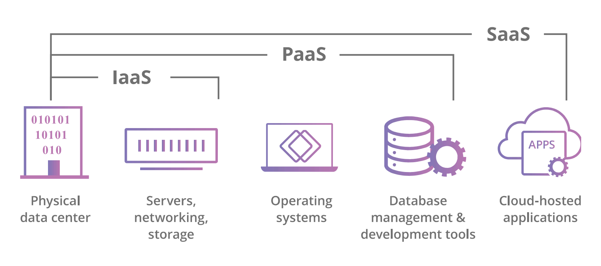
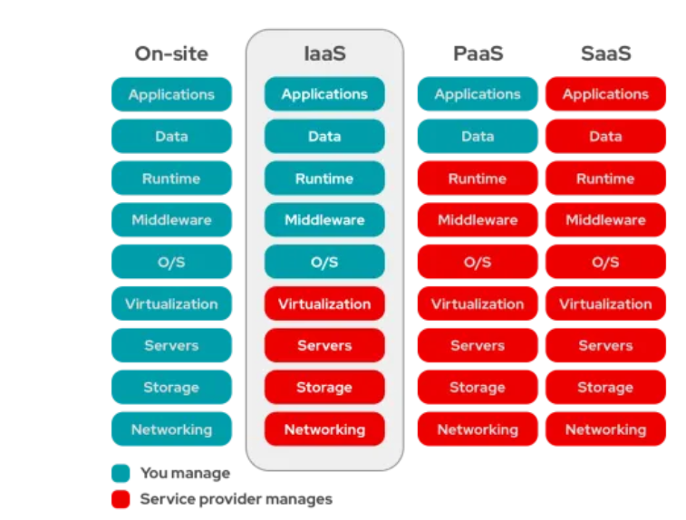

```{r setup, include=FALSE}
knitr::opts_chunk$set(echo = TRUE)
library(knitr)
```


# Problèmatique
Quesque le Cloud et les NAS? Ont-t-ils un intéret pour le grand-public ? Quelles solutions sont disponibles sur le marché ?


# Définitions
Un peu de définition “Le terme « cloud » désigne les serveurs accessibles sur Internet, ainsi que les logiciels et bases de données qui fonctionnent sur ces serveurs.” (@cloudflare_quest-ce_nodate) 

“Un système de NAS (Network Attached Storage) est un dispositif de stockage de grande capacité connecté à un réseau qui permet aux utilisateurs et aux clients autorisés du réseau de stocker et de récupérer des données à partir d’un emplacement centralisé.” (@hpe_quest-ce_nodate)

# Présentation Générale
Le Cloud et les NAS ont pour point commun la mise a disposition de données aux travers d'une connection internet. Ils permettent de gérer l'accès a ses données au cas par cas selon l'utilisateur. Cependant la notion de NAS est l'un des sous-ensemble de possibilité qu'offre les solutions Clouds. 

## Le Cloud
Le Cloud fonctionne sur la base de la virtualisation, ce qui veut dire qu'un serveur physique peut regrouper différents produits, solutions, entreprises, clients... en ne faisant apparaître à l'utilisateur que la ou les parties qui le concernant.
Les services de type cloud se divisent en 4 catégories en fonction des besoins des entreprises. 

```{r logo, echo=FALSE, fig.pos="H", out.width = '100%', fig.align = "center", fig.cap="Modèles de services Cloud  (cloudflare, sans date)"}

```

La première est un Cloud privé géré en interne sur site qui s'apparente aux solutions NAS que l'on abordera ensuite. 
Ensuite il y a l'IaaS pour Infrastructure-as-a-Service dans ce cas, le client loue uniquement l'infrasture physique du serveur et doit par lui même installer ses logiciels, géré ses accès, la troisième est PaaS pour Platform-as-a-Service dans ce cas-là l'entreprise en plus de la location du matériel physique, les composants logiciels qui permettent de la création de ses logiciels. Enfin la dernière solution, SaaS pour Software-as-a-Service où le client loue le matériel avec le logiciel simultanéement. 

```{r Categorie, echo=FALSE, fig.pos="H", out.width = '40%', fig.align = "center", fig.cap="Gestion d'un Cloud  (redhat, sans date)"}

```

La grande différence entre les services est le contrôle de l'entreprise sur le système en effet, elle peut-être propriétaire ou locataire et ce à des niveaux différents selon ses besoins et nécéssités.


## Les NAS
La notion de Cloud et de NAS sont fortement interconnectés pour les utilisations personnelles, en effet il s’agit d’une solution de stockage d’information à forte capacité disponible à distance par l’utilisateur. 

Un appareil NAS pour Network Attached Storage est un ordinateur composé de plusieurs unités de stockage majoritairement composé de HDD. Cette ordinateur va acceuillir un système d'exploitation specialement dédié pour la gestion de fichiers avec une interface web afin d'y accéder à distance. 

La majorité des systèmes se basent sur une distribution linux, on notera différentes options disponibles sur le marché : True NAS Community Edition, OpenMediaVault, XigmaNAS et Rockstor... (@thiefstep_understanding_2025) Ces solutions possèdent des caractéristiques communes avec une interface graphique pour gérer son matériel, la possibilité de mettre en place des protections contre la panne avec des modes RAID... (@nas_quel_2023)

# Possibilité d'Utilisation

En plus de sa fonction initiale de stockage de fichier et donnée pour désengorger le stockage de nos outils de travail, les NAS ont la possibilité de se transformer en hub de fonctionnalité pour un logement ou une habitation en effet, il est possibible d'ajouter de nombreuses fonctionnalités comme la gestion d'une boite mail en local, le streaming de vidéo ou de film directement sur une télévision ou une tablette, ou encore la centralisation du flux d'une installation de vidéo surveillance afin de ne pas dépendre d'un service tier. (@coolblue_que_nodate, @inc_solutions_nodate)

Cepandent les NAS ont la possibilité de faire de la virtualisation, la plupart du temps celà va être utilisé pour faire tourner des conteneurs contenants une ou plusieurs applications précises qui seront limités à leur conteneur sans possibilité initalements d'interagir avec l'ensemble du système. (@_wannabeknowitall_please_2020) Cette multitude de petite machine virtuelle permettent d'étendre les possibilités des NAS plus loin que le simple stockage de donnée, il peut alors jouer le rôle de serveur de jeux pour plusieurs personnes, la possibilité de monitorer de nombreux appareils via un logiciel comme Home Assistant... ou encore le filtrage de votre connection internet afin de suspendre les requêtes publicitaires des pages internets consulters. (@cachem_nas_2022, @leo_-_techmaker_jai_2025)

# Conclusion
L’utilisation d’une solution de Cloud personnel est un ejeux majeur pour la souveraineté de ses données personnelles ainsi que du facteur économique. Cependant cela requière un investissement en temps et en argent afin de trouver, mettre en place et maintenir cette solution de stockage dans le temps.


# Bibliographie

Liste des publications :
